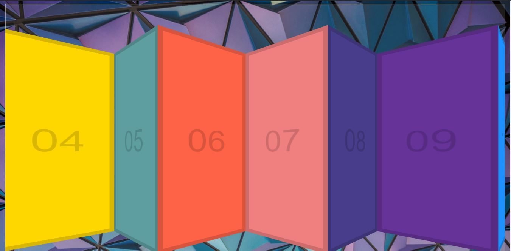

# Click-Drag

This is project 27 in Wes Bos' JavaScript 30 course.  In this lesson we built a click and drag function which moves HTML divs across the screen when the user clicks down, holds and moves the mouse. It was a short and fun project to make.  If you're interested in doing it yourself, you can find the video <a href="https://www.youtube.com/watch?v=C9EWifQ5xqA">here.</a>

